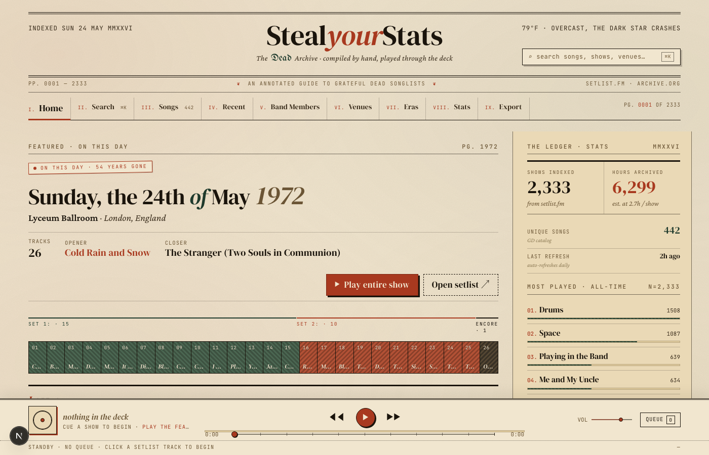
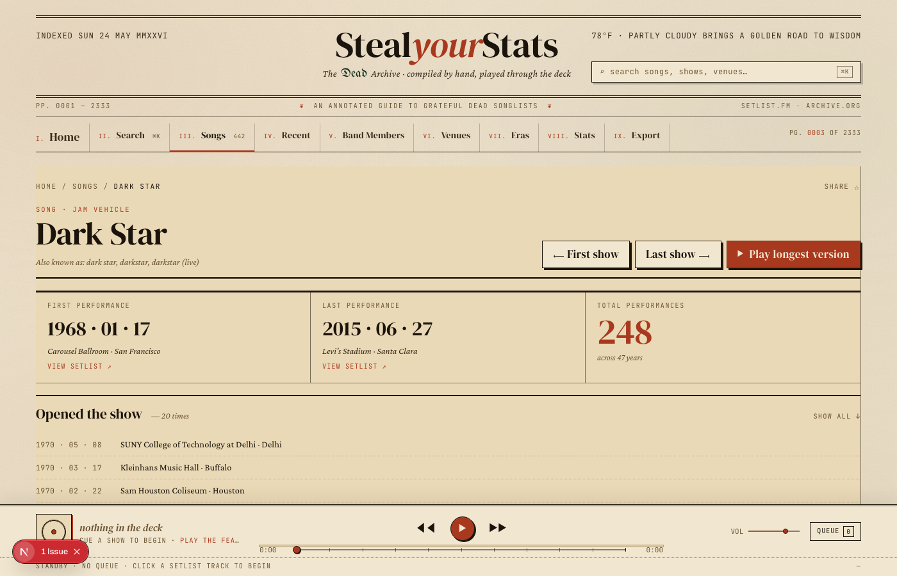
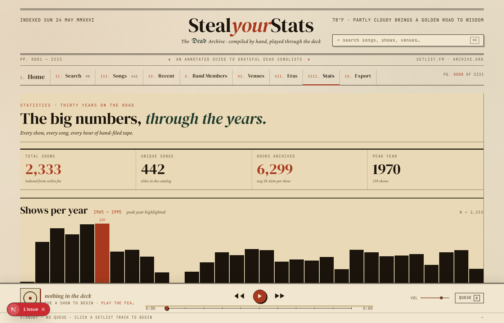
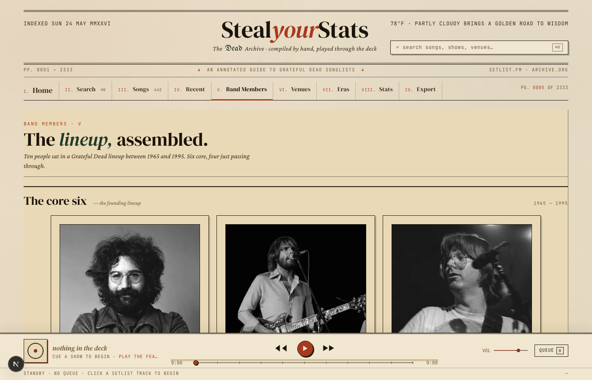
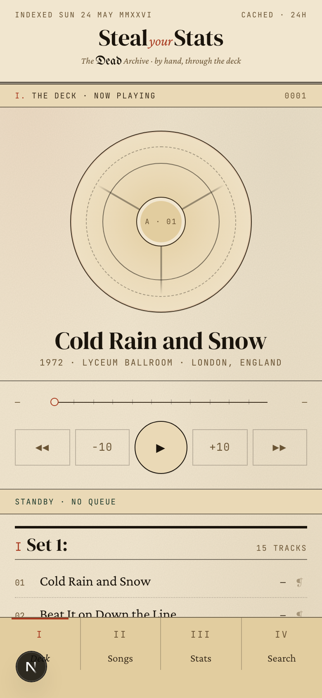
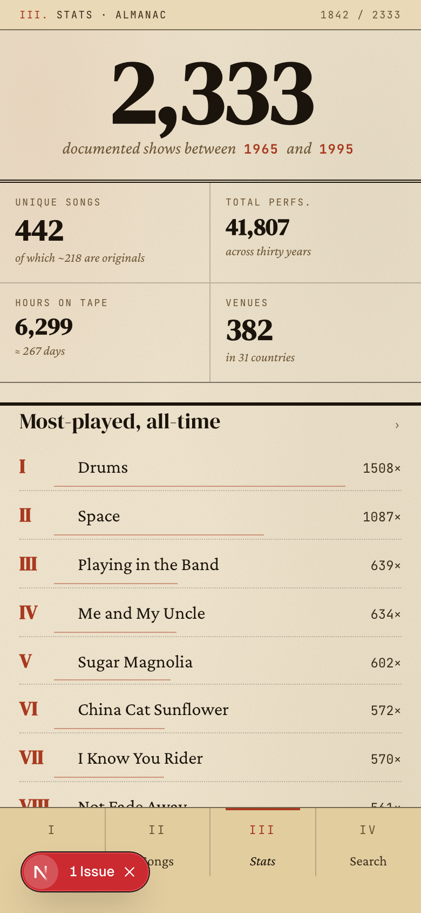
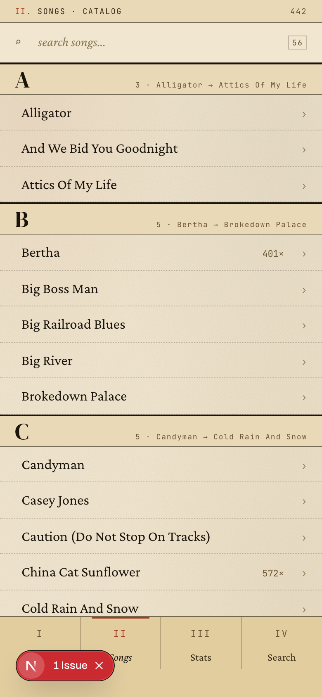

# StealYourStats

A Grateful Dead statistics and audio player built like a vintage newspaper. Browse 2,300+ shows, look up every song's full performance history, and stream archive recordings — all in one place.

---

## Screenshots

<table>
  <tr>
    <td></td>
    <td></td>
  </tr>
  <tr>
    <td align="center"><em>Home — On This Day</em></td>
    <td align="center"><em>Song detail — Dark Star (248 performances)</em></td>
  </tr>
  <tr>
    <td></td>
    <td></td>
  </tr>
  <tr>
    <td align="center"><em>Stats — Almanac with shows-per-year chart</em></td>
    <td align="center"><em>Artists — full band roster with photos</em></td>
  </tr>
</table>

**Mobile**

<table>
  <tr>
    <td></td>
    <td></td>
    <td></td>
  </tr>
  <tr>
    <td align="center"><em>Deck — reel player + setlist</em></td>
    <td align="center"><em>Stats — leaderboard</em></td>
    <td align="center"><em>Songs — alphabetical catalog</em></td>
  </tr>
</table>

---

## Features

### On This Day
The home page surfaces the best show from today's date across all years of GD history. It picks the recording with the most tracks closest to 1977 and shows the full setlist, opener/closer callouts, a venue tidbit, and a one-click "Play entire show" button.

### Song Detail Pages
Each song gets a dedicated stats page:

- **Total performances** and first/last show dates
- **Position breakdown** — how often it opened a set, closed a set, or appeared as an encore (with paginated show lists for each)
- **Versions table** — every known recording sortable by duration, date, or venue, with Archive.org durations where available
- **Shortest / longest** version callout with exact timing
- **One-click playback** — tap any row to stream that version directly; or add individual tracks to the queue

### In-Browser Audio Player
Streams audio directly from the Internet Archive (archive.org). No downloads, no accounts.

- Persistent queue across navigation (stored in `localStorage`)
- Play an entire show in order or jump to any individual track
- Previous / Next track controls
- Seek bar with live elapsed and total time
- Volume control
- Queue drawer showing all cued tracks with durations
- −10 / +10 second skip buttons

### Songs Catalog
Full alphabetical catalog of 442+ songs with per-song play counts pulled from the stats API. Filterable by search.

### Venues
382+ venues ranked by number of shows. Filter by name or city. Each venue links to a show list filtered to that location.

### Artists
Photo roster of all 10 members who played with the Dead — core six plus rotating keyboardists. Each member card shows their active years and total show count. Member detail pages break down shows per year with a bar chart.

### Stats / Almanac
- **Leaderboard** — most-played songs of all time with a proportional bar chart
- **Shows per year** bar chart across the full 1965–1995 run
- **Era distribution** donut chart (Pigpen era, Europe '72, Brent years, etc.)
- **Dark Star breakdown** — 232 performances charted by set position (mid-set, opener, closer, encore)
- Summary KPIs: total shows indexed, unique songs, hours archived

### Eras
Five curated eras — Primal Dead, Europe '72, Hiatus & Return, Brent Years, Final Chapter — each with a description, signature songs, and a full show list filtered to that era.

### Search
Full-text search across songs and shows. Song results link to song detail pages; show results link to setlists with playback.

### Recent
Personal play history logged to `localStorage`. Shows every track played grouped by day, with timestamps and durations.

### Live Weather
The masthead pulls live weather from Open-Meteo for the Grateful Dead's home coordinates (Marin County, CA) and renders it with Grateful Dead–flavored descriptions ("Looks like rain" → *"Cold rain falling down"*).

### Mobile Shell
A fully separate mobile experience (`≤ 767px`) built as a fixed overlay so the desktop layout is completely unaffected:

- **Deck** — reel-to-reel graphic, now-playing title, transport controls, live seek bar, full setlist
- **Songs** — alphabetical catalog with sticky letter headers
- **Stats** — big-figure KPIs, leaderboard, era donut
- **Search** — debounced live search with song and show results
- Back button on all detail pages
- Mini-player bar on non-deck screens

---

## Tech Stack

| Layer | Choice |
|---|---|
| Framework | Next.js 15 (App Router) |
| UI | React 19 + TypeScript |
| Styling | Tailwind CSS 4 + custom CSS (no utility classes in the vault shell) |
| Data fetching | SWR |
| Unit tests | Vitest + Testing Library |
| E2E tests | Playwright |
| Package manager | pnpm |

**External APIs**
- [setlist.fm](https://api.setlist.fm) — setlist and song performance data
- [Internet Archive](https://archive.org) — audio streaming
- [Open-Meteo](https://open-meteo.com) — live weather (no key required)

---

## Design System

The UI is styled as an aged ledger / broadsheet — aged cream stock, ink that's faded just enough, double-rule borders, and offset retro shadows throughout.

| Token | Value |
|---|---|
| `--paper` | `#f1e6cf` |
| `--ink` | `#1a140c` |
| `--rust` | `#a8391f` |
| `--forest` | `#1f3a2c` |
| `--serif-display` | DM Serif Display / Bodoni Moda |
| `--serif-body` | Crimson Pro |
| `--mono` | JetBrains Mono |
| `--blackletter` | UnifrakturMaguntia |

---

## Setup

### Prerequisites
- Node.js 20+
- pnpm (`npm i -g pnpm`)
- A [setlist.fm API key](https://api.setlist.fm/docs/1.0/index.html)

### Install

```bash
git clone https://github.com/nathanhbsimmons/steal-your-stats.git
cd steal-your-stats
pnpm install
```

### Environment

Create `.env.local` in the project root:

```env
SETLISTFM_API_KEY=your_key_here
```

### Run

```bash
pnpm dev        # dev server on http://localhost:3000
pnpm build      # production build
pnpm start      # serve production build
```

---

## Commands

```bash
pnpm dev          # Start dev server (Turbopack)
pnpm build        # Production build
pnpm start        # Serve production build
pnpm lint         # ESLint
pnpm typecheck    # TypeScript (tsc --noEmit)
pnpm test         # Vitest in watch mode
pnpm test:run     # Single test run
pnpm test:ui      # Vitest UI dashboard
```

Run a single test file:

```bash
pnpm test test/utils.test.ts
```

---

## Project Structure

```
app/
  api/                    # API routes
    song-facts/           # Performance stats for a song
    position-facts/       # Opener/closer/encore counts
    versions/             # All recordings of a song with durations
    on-this-day/          # Shows from today's date in GD history
    show/                 # Full setlist for a given date
    songs/                # Song catalog with search
    stats/                # Global leaderboard and year counts
    venues/               # Venue list with show counts
    archive/              # Archive.org resolution and track listing
    weather/              # Live weather from Open-Meteo
  page.tsx                # Home — On This Day
  song/[slug]/            # Song detail
  show/[date]/            # Show detail / setlist
  songs/                  # Song catalog
  stats/                  # Almanac
  venues/                 # Venue list
  artists/                # Band member roster
  member/[slug]/          # Member detail
  eras/[era-id]/          # Era detail with show list
  search/                 # Search
  recent/                 # Personal play history
  globals.css             # Design tokens + desktop styles
  mobile.css              # Mobile shell styles (all .mv-* scoped)

components/
  vault/                  # Desktop chrome (masthead, player, shell)
  mobile/                 # Mobile shell (mobile-shell.tsx)
  ui/                     # Shared primitives

lib/
  contexts/player-context.tsx   # Shared audio state (PlayerProvider)
  hooks/use-audio-player.ts     # Queue, playback, Archive.org resolution
  clients/                      # setlist.fm + Archive.org + MusicBrainz clients
  ids.ts                        # 60+ song title aliases → canonical names
  venue-tidbits.ts              # Curated venue history snippets
  cache.ts                      # In-memory TTL cache
  http.ts                       # Fetch wrapper with retries + backoff

test/                     # Vitest unit tests (28 files, ~230 tests)
tests/e2e/                # Playwright E2E tests (15 files)
```

---

## Architecture Notes

**Audio.** The `<audio>` element lives in `VaultPlayer` (inside `.vault-page`). On mobile, `.vault-page` is `display: none` — but audio playback continues regardless of display state. The mobile shell communicates with it via custom DOM events:

| Event | Direction | Purpose |
|---|---|---|
| `vault-seek-by` | mobile → player | Relative seek (−10 / +10 s) |
| `vault-seek-to-fraction` | mobile → player | Absolute seek from bar tap |
| `vault-time-update` | player → mobile | `currentTime` / `duration` broadcast |

**Song resolution.** `lib/ids.ts` maps 60+ variant spellings (e.g. *St. Stephen*, *Saint Stephen*, *St Stephen*) to a single canonical title before any API call.

**Responsive split.** Mobile (≤ 767px) hides `.vault-page` and shows `.mv`. Desktop (≥ 768px) hides `.mv`. Zero JavaScript involved in the split — pure CSS media queries. Both share the same `PlayerProvider` context so queue state is always in sync.

---

## Data Sources

| Source | License | Used for |
|---|---|---|
| [setlist.fm](https://www.setlist.fm) | CC BY 4.0 | Setlists, venue data, song catalog |
| [Internet Archive](https://archive.org) | Per recording (open) | Audio streaming |
| [Open-Meteo](https://open-meteo.com) | CC BY 4.0 | Live weather |

This project is for personal and educational use.
